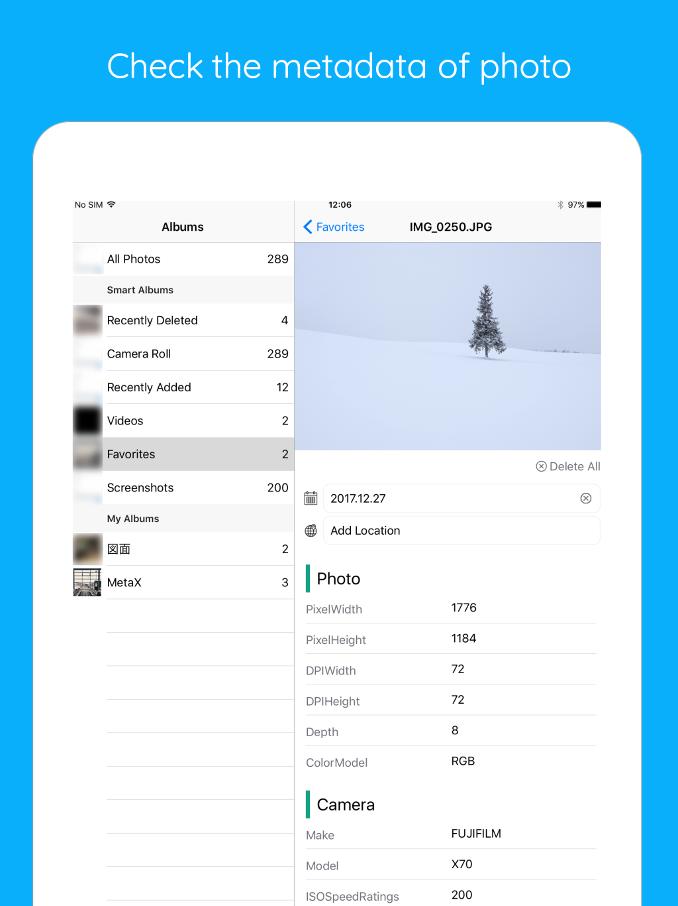

# MetaX

MetaX is an iOS tool for viewing and editing photo metadata. It runs entirely on-device and focuses on privacy, performance, and a distinct Neo-Brutalist aesthetic.

## 🚀 Key Features

* **Metadata Editor:** Edit EXIF, TIFF, and GPS data. Uses a transactional engine for reliable timestamp and location updates.
* **Privacy First:** One-tap metadata removal. All processing happens locally; no data is uploaded.
* **Save-as-Copy:** Supports both non-destructive "Save as Copy" and direct overwriting.
* **Automatic Organization:** Edited photos are automatically saved to a dedicated "MetaX" album.
* **Performance:** Lazy-loading and async thumbnail rendering for fast browsing of large libraries.
* **Universal UI:** Adaptive layout for iPhone and iPad in all orientations.

## 🛠 Architecture & Implementation

The project follows modern Swift standards and architectural patterns:

* **Swift 6 Concurrency:** Full migration to Swift 6 with actors and strict concurrency checking.
* **MVVM-C:** Uses the Coordinator pattern to separate navigation from view logic.
* **Observation Framework:** Powered by `@Observable` for efficient UI updates.
* **Dependency Injection:** Centralized `DependencyContainer` for managing service lifecycles.
* **Programmatic UI:** 100% UIKit without Storyboards or XIBs.

## 🎨 Design: Neo-Brutalism

* **High Contrast:** Bold borders and "Green Sea" accents.
* **Stacked Layers:** Offset shadows and layers instead of standard blurs.
* **Monospace Type:** Used for logotypes and technical data to emphasize precision.
* **Adaptive Components:** Responsive layout that adjusts to any screen size.

## 📸 Screenshots

| iPhone | iPad |
| :---: | :---: |
|  |  |

## 📄 License

MetaX is licensed under the **MIT License + Commons Clause**.

**What does this mean?**
You are free to explore the code, learn from the architecture, and use small snippets in your own projects. However, **direct cloning and distribution on the App Store (or any commercial sale) is strictly prohibited.**

See the [LICENSE](LICENSE) file for the full legal text.

## 📲 Download

[Download MetaX on the App Store](https://itunes.apple.com/us/app/metax/id1376589355)
